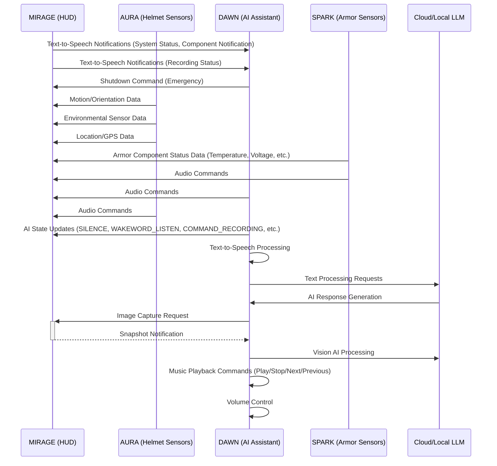

# MIRAGE
Multi-Input Reconnaissance and Guidance Environment (Heads-Up Display)

After you've installed the OS on the Jetson, do this first.

I. Update everything.
`sudo apt update
sudo apt upgrade`

II. Install necessary packages.
`sudo apt-get install cmake libudev-dev libxext-dev libwebp-dev libpulse-dev libvorbis-dev libjson-c-dev libsamplerate-dev libfreetype6-dev libcurl4-openssl-dev nvidia-jetpack libmosquitto-dev mosquitto libsndfile-dev libssl-dev libgd-dev`

III. Manually install the latest SDL libraries.
- SDL2 (latest 2.28.2)
- SDL2_image (latest 2.6.3)
- SDL2_ttf (latest 2.20.2)

IV. Setup IO (Cameras, SPI)
`sudo /opt/nvidia/jetson-io/jetson-io.py`
Configure Jetson 40pin Header->Configure header pins manually->Enable 'spi1'->Save pin changes
Configure Jetson 24pin CSI Connector->Configure for compatible hardware->Camera IMX219 Dual OR Camera IMX477 Dual OR Camera IMX477 Dual 4 Lane->Save pin changes
Save and exit without rebooting

V. Install Jetson Inference (for Object Detection)
https://github.com/dusty-nv/jetson-inference/blob/master/docs/building-repo-2.md

```
git clone https://github.com/dusty-nv/jetson-inference
cd jetson-inference
git submodule update --init
mkdir build
cd build
cmake ..
make -j8
sudo make install
```

VI. Update user permissions.
Add groups to user: `dialout`

## OASIS Communication Sequence Diagram


